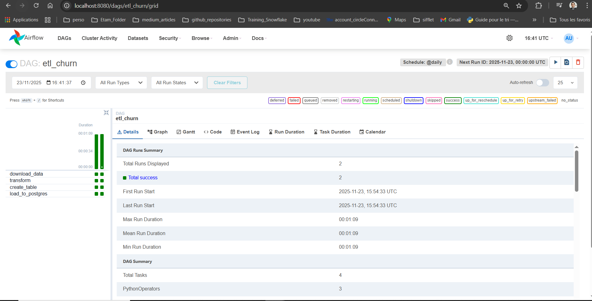
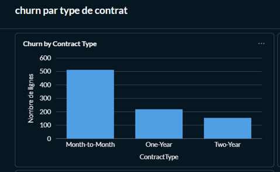
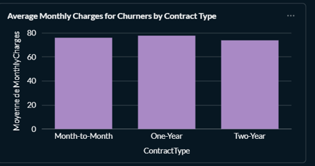
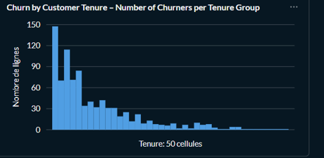

# Telecom Churn ELT Pipeline

## Overview

This project creates an automated ELT (Extract, Load, Transform) pipeline to analyze Telecom Customer Churn.  
It ingests data from Kaggle, stores raw data in a staging area, anonymizes Personal Identifiable Information (PII), and creates a clean dataset ready for reporting.

---

## Architecture

The solution is fully containerized using Docker.

- **Extraction :** Python script using Kaggle API.
- **Orchestration :** Apache Airflow (Scheduled to run hourly).
- **Database :** PostgreSQL (Split into `staging` and `analytics` schemas).
- **Transformation :** Pandas & SQLAlchemy (Clean & Anonymize).
- **Reporting :** Metabase (Connected to the `analytics` schema).

---

## Prerequisites

- Docker & Docker Compose installed
- A Kaggle Account (API credentials)

---

## Setup & Usage

### 1. Clone the Project

---

git clone https://github.com/yourusername/telecom-churn-pipeline.git
cd telecom-churn-pipeline

---

### 2. Configure Credentials

Create a `.env` file in the root directory and add your Kaggle credentials:

### 2. Configure Credentials

Create a `.env` file in the root directory and add your Kaggle credentials:

---

KAGGLE_USERNAME=your_username
KAGGLE_KEY=your_secret_key

---

*Never commit your `.env` file!*

---

### 3. Build & Launch the Stack

---

docker-compose up --build

---

### 4. Initialize Airflow

In a new terminal:

---

docker-compose exec airflow-webserver airflow db init

docker-compose exec airflow-webserver airflow users create
--username admin --firstname Admin --lastname User --role Admin --email admin@example.com --password admin

---

### 5. Trigger the Pipeline

- Go to [http://localhost:8080](http://localhost:8080)
- Login with `admin/admin`
- Trigger the `etl_churn` DAG or wait for the hourly scheduler, you can view this via :

---

### 6. Verification

- Raw data is in the `staging.customer_churn` table
- Processed data is in the `analytics.customer_churn` table

---

### 7. Access Metabase Dashboard

- Go to [http://localhost:3000](http://localhost:3000)
- Login to Metabase (set up during first use)
- Open the dashboard **Churn Analysis**

---

## 📊 Example Dashboards

### 1. Churn by Contract Type

---

### 2. Average Monthly Charges for Churners by Contract Type

---

### 3. Churn by Customer Tenure – Number of Churners per Tenure Group

---

## Project Structure

telecom-churn-pipeline/
│
├── dags/
│ └── churn_pipeline.py # Airflow DAG pipeline
├── data/ # Data folder (auto-filled)
├── .env # Kaggle API keys (not in repo)
├── .gitignore
├── docker-compose.yaml
├── Dockerfile
├── README.md
├── requirements.txt
└── images/ # Dashboard screenshots for README

undefined

## Notes

- All services are up in Docker for easy, portable testing.
- Airflow manages and schedules all steps, with full restartability and monitoring.
- Data is anonymized and preprocessed for business reporting.
- Metabase dashboards are ready to use and can be edited/forked as needed.

---

**Ready to use for any Telecom churn analysis!**
Place bien tes fichiers images dans le dossier images/ (ou modifie le chemin dans le README).

